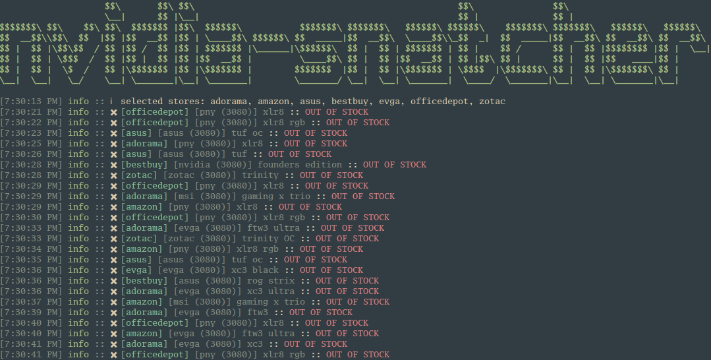

# nvidia-snatcher 

[FAQ](#FAQ) | [Issues](https://github.com/jef/nvidia-snatcher/issues)
| [Wiki](https://github.com/jef/nvidia-snatcher/wiki)

The purpose of this bot is to get an Nvidia card. It tries multiple things to do that.

- Currently, `nvidia-snatcher` is not capable of purchasing a card for you
- Scrapes multiple websites for patterns of being stocked
	- API requests are a work in progress (very soon)
- Opens browser when stock is available
- Ability to send notifications when stock is available

## Installation overview

Linux, macOS, and Windows are all capable operating systems.

You do not need any computer skills, smarts, or anything of that nature. You are very capable as you have made it this
far. Some basic understanding how a terminal, git, and or Node.js is a bonus, but that does not limit you to
getting `nvidia-snatcher` running!

### Installation: native

- [Node.js 15](https://nodejs.org/en/)
- [git](https://git-scm.com/)
- Clone this project `git clone https://github.com/jef/nvidia-snatcher.git`
- Run `npm install`
- Copy `.env-example` to a new file `.env` and edit the `.env` file to your liking using
  your [favorite text editor](https://code.visualstudio.com/)
	- More on this in [customization](#Customization)
- Run `npm run start` to start

At any point you want the program to stop, use <kbd>Ctrl</kbd> + <kbd>C</kbd>.

> :point_right: Please visit the [wiki](https://github.com/jef/nvidia-snatcher/wiki) if you need more help with installation.

### Installation: Docker

Available via GitHub Container Registry.

| Tag | Note |
|:---:|---|
| `latest` | Latest stable build |
| `nightly` | Latest HEAD build, could be unstable |

Use `docker run --cap-add=SYS_ADMIN -it --rm --env-file ./.env ghcr.io/jef/nvidia-snatcher:nightly` to run.

### Developer notes

The command `npm run start:dev` can be used instead of `npm run start` to automatically restart the project when
filesystem changes are detected in the `src/` folder or `.env` file.

## Customization

To customize `nvidia-snatcher`, make a copy of `.env-example` as `.env` and make any changes to your liking. _All
environment variables are **optional**._

Expand to see all available options

### Application

| Environment variable | Description | Notes |
|:---:|---|---|
| `BROWSER_TRUSTED` | Skip Chromium Sandbox | Useful for containerized environments, default: `false` |
| `HEADLESS` | Puppeteer to run headless or not | Debugging related, default: `true` |
| `INCOGNITO` | Puppeteer to run incognito or not | Debugging related, default: `false` |
| `IN_STOCK_WAIT_TIME` | Time to wait between requests to the same link if it has that card in stock | In seconds, default: `0` |
| `LOG_LEVEL` | [Logging levels](https://github.com/winstonjs/winston#logging-levels) | Debugging related, default: `info` |
| `LOW_BANDWIDTH` | Blocks images/fonts to reduce traffic | Disables ad blocker, default: `false` |
| `OPEN_BROWSER` | Toggle for whether or not the browser should open when item is found | Default: `true` |
| `PAGE_BACKOFF_MIN` | Minimum backoff time between retrying requests for the same store when a forbidden response is received | Default: `10000` |
| `PAGE_BACKOFF_MAX` | Maximum backoff time between retrying requests for the same store when a forbidden response is received | Default: `3600000` |
| `PAGE_SLEEP_MIN` | Minimum sleep time between queries of the same product page | In milliseconds, default: `5000` |
| `PAGE_SLEEP_MAX` | Maximum sleep time between queries of the same product page | In milliseconds, default: `10000` |
| `PAGE_TIMEOUT` | Navigation Timeout in milliseconds | `0` for infinite, default: `30000` |
| `PROXY_ADDRESS` | IP Address or fqdn of proxy server |
| `PROXY_PORT` | TCP Port number on which the proxy is listening for connections | Default: `80` |
| `SCREENSHOT` | Capture screenshot of page if a card is found | Default: `true` |
| `USER_AGENT` | Custom User-Agents headers for HTTP requests | Newline separated, e.g.: `USER_AGENT_STRING1 \n USER_AGENT_STRING2` | | Default: `Mozilla/5.0 (X11; Linux x86_64) AppleWebKit/537.36 (KHTML, like Gecko) Chrome/78.0.3904.108 Safari/537.36` |
| `WEB_PORT` | Starts a webserver to be able to control the bot while it is running; optional | Default: disabled |

> :point_right: You can find your computer's user agent by [searching google for "my user agent"](http://google.com/search?q=my+user+agent)

> :point_right: Data usage is [known to be high](https://github.com/jef/nvidia-snatcher/issues?q=is%3Aissue+sort%3Aupdated-desc+bandwidth). This is expected as the program scrapes many websites in parallel 24/7. To help reduce this, use `LOW_BANDWIDTH="true"`. We are looking into other solutions as well, but is low priority.

### Filters

| Environment variable | Description | Notes |
|:---:|---|---|
| `COUNTRY` | [Supported country](#supported-countries) you want to be scraped | Currently only used by Nvidia, default: `usa` |
| `MAX_PRICE_SERIES_3070` | Maximum price allowed for a match, applies 3070 series cards (does not apply to these sites: Nvidia, Asus, EVGA) | Default: leave empty for no limit, otherwise enter a price (enter whole dollar amounts only, avoid use of: dollar symbols, commas, and periods.) e.g.: `1234` - Cards above `1234` will be skipped. |
| `MAX_PRICE_SERIES_3080` | Maximum price allowed for a match, applies 3080 series cards (does not apply to these sites: Nvidia, Asus, EVGA) | Default: leave empty for no limit, otherwise enter a price (enter whole dollar amounts only, avoid use of: dollar symbols, commas, and periods.) e.g.: `1234` - Cards above `1234` will be skipped. |
| `MAX_PRICE_SERIES_3090` | Maximum price allowed for a match, applies 3090 series cards (does not apply to these sites: Nvidia, Asus, EVGA) | Default: leave empty for no limit, otherwise enter a price (enter whole dollar amounts only, avoid use of: dollar symbols, commas, and periods.) e.g.: `1234` - Cards above `1234` will be skipped. |
| `MICROCENTER_LOCATION` | Specific MicroCenter location(s) to search | Comma separated, e.g.: `marietta,duluth`, default: `web` |
| `NVIDIA_ADD_TO_CART_ATTEMPTS` | The maximum number of times the `nvidia-api` add to cart feature will be attempted before failing | Default: `10` |
| `NVIDIA_SESSION_TTL` | The time in milliseconds to keep the cart active while using `nvidia-api` | Default: `60000` |
| `SHOW_ONLY_BRANDS` | Filter to show specified brands | Comma separated, e.g.: `evga,zotac` |
| `SHOW_ONLY_MODELS` | Filter to show specified models | Both supported formats are comma separated   1. Standard  E.g.: `founders edition,rog strix`    2. Advanced E.g: `MODEL:SERIES`, E.g: `founders edition:3090,rog strix` |
| `SHOW_ONLY_SERIES` | Filter to show specified series | Comma separated, e.g.: `3080` |
| `STORES` | [Supported stores](#supported-stores) you want to be scraped | Both supported formats are comma separated   1. Standard  E.g.: `"nvidia"`    2. Advanced E.g: `STORE:PAGE_SLEEP_MIN:PAGE_SLEEP_MAX`, E.g: `nvidia:10000:30000`   Default: `nvidia` |

Supported stores

> :point_right: Used with the `STORES` variable.

| Stores | Environment variable |
|:---:|:---:|
| Adorama | `adorama`|
| Alternate (DE) | `alternate`|
| Alternate (NL) | `alternate-nl`|
| Amazon | `amazon`|
| Amazon (CA) | `amazon-ca`|
| Amazon (DE) | `amazon-de`|
| Amazon (ES) | `amazon-es`|
| Amazon (NL) | `amazon-nl`|
| Amazon (UK) | `amazon-uk`|
| Aria PC (UK) | `aria`|
| ASUS | `asus` |
| ASUS (DE) | `asus-de` |
| Azerty (NL) | `azerty`|
| B&H | `bandh`|
| Best Buy | `bestbuy`|
| Best Buy (CA) | `bestbuy-ca`|
| Box (UK) | `box`|
| Caseking (DE) | `caseking`|
| CCL (UK) | `ccl`|
| Computeruniverse (DE) | `computeruniverse` |
| Coolblue (NL) | `coolblue`|
| Coolmod (ES) | `coolmod`|
| Currys (UK) | `currys`|
| Cyberport (DE) | `cyberport` |
| eBuyer (UK) | `ebuyer`|
| EVGA | `evga`|
| EVGA (EU) | `evga-eu`|
| Gamestop | `gamestop`|
| Mediamarkt (DE) | `mediamarkt`|
| Micro Center | `microcenter`|
| Mindfactory (DE) | `mindfactory` |
| Newegg | `newegg`|
| Newegg (CA) | `newegg-ca`|
| Notebooksbilliger (DE) |`notebooksbilliger`|
| Novatech (UK) | `novatech`|
| Nvidia | `nvidia`|
| Nvidia (API) | `nvidia-api`|
| Office Depot | `officedepot`|
| Overclockers (UK) | `overclockers`|
| PCComponentes (ES) | `pccomponentes`|
| PNY | `pny`|
| Proshop (DE) | `proshop-de`|
| Proshop (DK) | `proshop-dk`|
| Saturn (DE) | `saturn`|
| Scan (UK) | `scan`|
| Very (UK) | `very`|
| Zotac | `zotac`|

Micro Center stores

> :point_right: Used with the `MICROCENTER_LOCATION` variable.

> :point_right: Before using `web`, please review [this issue comment](https://github.com/jef/nvidia-snatcher/issues/442#issuecomment-703297393).

| Store name |
|:---:|
| `brooklyn` |
| `brentwood` |
| `cambridge` |
| `chicago` |
| `columbus` |
| `dallas` |
| `denver` |
| `duluth` |
| `fairfax` |
| `flushing` |
| `houston` |
| `madison-heights` |
| `marietta` |
| `mayfield-heights` |
| `north-jersey` |
| `overland-park` |
| `parkville` |
| `rockville` |
| `sharonville` |
| `st-davids` |
| `st-louis-park` |
| `tustin` |
| `westbury` |
| `westmont` |
| `yonkers` |

Supported brands and models

> :point_right: Used with the `SHOW_ONLY_BRANDS` and `SHOW_ONLY_MODELS` variables.

| Brand | Model |
|:---:|---|
| `asus` | `dual`, `dual oc`, `rog strix`, `rog strix oc`, `tuf`, `tuf oc` |
| `evga` | `ftw3`, `ftw3 ultra`, `xc3`, `xc3 black`, `xc3 ultra` |
| `gainward` | `phantom gs`, `phoenix`, `phoenix gs`, `phoenix gs oc` |
| `gigabyte` | `aorus master`, `aorus xtreme`, `eagle`, `eagle oc`, `gaming`, `gaming oc`, `turbo`, `vision`, `vision oc` |
| `inno3d` | `gaming x3`, `ichill x3`, `ichill x4`, `twin x2 oc` |
| `kfa2` | `sg oc` |
| `msi` | `gaming x trio`, `ventus 2x oc`, `ventus 3x`, `ventus 3x oc` |
| `nvidia` | `founders edition` |
| `palit` | `gamerock oc`, `gaming pro`, `gaming pro oc` |
| `pny` | `dual fan`, `xlr8`, `xlr8 rgb` |
| `zotac` | `amp holo`, `amp extreme holo`, `trinity`, `trinity oc`, `twin edge`, `twin edge oc` |

Supported countries (used with nvidia and nvidia-api)

> :point_right: Used with the `COUNTRY` variable.

| Country | 3080 FE | 3090 FE | Test Card | Notes |
|:---:|:---:|:---:|:---:|:---:|
| austria | `✔` | `✔` | `✔` | |
| belgium | `✔` | `✔` | `✔` | |
| canada | `✔` | `✔` | `✔` | |
| czechia | `✔` | `✔` | `✔` | |
| denmark | `✔` | | `✔` | Missing RTX 3090 |
| finland | `✔` | | `✔` | Missing RTX 3090 |
| france | `✔` | `✔` | `✔` | |
| germany | `✔` | `✔` | `✔` | |
| great_britain | `✔` | `✔` | `✔` | |
| ireland | `✔` | `✔` | `✔` | |
| italy | `✔` | `✔` | `✔` | |
| luxembourg | `✔` | `✔` | `✔` | |
| netherlands | `✔` | `✔` | `✔` | |
| norway | `✔` | `✔` | `✔` | |
| poland | `✔` | `✔` | `✔` | |
| portugal | `✔` | | | RTX 3080 only |
| spain | `✔` | `✔` | `✔` | |
| sweden | `✔` | `✔` | `✔` | |
| usa | `✔` | `✔` | `✔` | |

### Notifications

> :point_right: You can test your notification configuration by running `npm run test:notification`.

Desktop

| Environment variable | Description | Notes |
|:---:|---|---|
| `DESKTOP_NOTIFICATIONS` | Display desktop notifications using [node-notifier](https://www.npmjs.com/package/node-notifier) | Default: `false` |
| `PLAY_SOUND` | Play this sound notification if a card is found | Relative path accepted, valid formats: wav, mp3, flac, E.g.: `path/to/notification.wav`, [free sounds available](https://notificationsounds.com/) |

Discord

| Environment variable | Description | Notes |
|:---:|---|---|
| `DISCORD_NOTIFY_GROUP` | Discord group you would like to notify | Can be comma separated, use role ID, E.g.: `<@2834729847239842>` |
| `DISCORD_WEB_HOOK` | Discord Web Hook URL | Can be comma separated, use whole webhook URL |

Email and SMS

| Environment variable | Description | Notes |
|:---:|---|---|
| `EMAIL_PASSWORD` | Gmail password | See below if you have MFA |
| `EMAIL_TO` | Destination Email | Defaults to username if not set. Can be comma separated |
| `EMAIL_USERNAME` | Gmail address | E.g.: `jensen.robbed.us@gmail.com` |
| `PHONE_CARRIER` | [Supported carriers](#supported-carriers) for SMS | Email configuration required |
| `PHONE_NUMBER` | 10 digit phone number | E.g.: `1234567890`, email configuration required |
| `SMTP_ADDRESS` | IP Address or fqdn of smtp server |
| `SMTP_PORT` | TCP Port number on which the smtp server is listening for connections | Default: `25` |

> :point_right: If you have multi-factor authentication (MFA), you will need to create an [app password](https://myaccount.google.com/apppasswords) and use this instead of your Gmail password.

#### Supported carriers

| Carrier | Environment variable | Notes |
|:---:|:---:|:---:|
| AT&T | `att` | |
| AT&T Prepaid | `attgo` | |
| Bell | `bell` | |
| Fido | `fido` | |
| Google | `google`| |
| Koodo | `koodo` | |
| Mint | `mint`| |
| Rogers | `rogers` | |
| Sprint | `sprint`| |
| Telus | `telus`| |
| T-Mobile | `tmobile`| |
| Verizon | `verizon`| Works with Visible |
| Virgin | `virgin`| |
| Virgin (CA) | `virgin-ca`| |

MQTT

| Environment variable | Description | Notes |
|:---:|---|---|
| `MQTT_BROKER_ADDRESS` | IP address or URL of MQTT Broker | e.g 192.168.1.xxx or broker.hivemq.com |
| `MQTT_BROKER_PORT` | Network port of MQTT Broker | Default: 1883 |
| `MQTT_CLIENT_ID` | Unique ClientID (only if required by MQTT Broker), typically not required when only publishing alerts | eg. client-123456 |
| `MQTT_PASSWORD` | MQTT password - only use with MQTT brokers on private networks, if required. Will not be sent over public networks for safety. | e.g mysecret |
| `MQTT_QOS` | QoS level for published alerts to broker (https://www.npmjs.com/package/mqtt#about-qos) | Default: 0, Can be 0, 1, or 2 |
| `MQTT_TOPIC` | Topic to publish alerts to. Can include %store%, %series%, %brand%, %model% for dynamic topics | Default: nvidia-snatcher/alert e.g nv-alert/%store%/%series%/%brand%/%model%/alert |
| `MQTT_USERNAME` | MQTT username - (only if required by MQTT Broker) | e.g myusername |

PagerDuty

| Environment variable | Description | Notes |
|:---:|---|---|
| `PAGERDUTY_INTEGRATION_KEY` | PagerDuty Events API v2 Integration Key. Obtain one in PagerDuty - <Service you want to use> - Integrations | |
| `PAGERDUTY_SEVERITY` | Severity of PagerDuty events | Default: `info` |

Pushbullet

| Environment variable | Description | Notes |
|:---:|---|---|
| `PUSHBULLET` | PushBullet API key | Generate at https://www.pushbullet.com/#settings/account | |

Pushover

| Environment variable | Description | Notes |
|:---:|---|---|
| `PUSHOVER_TOKEN` | Pushover access token | Generate at https://pushover.net/apps/build | |
| `PUSHOVER_USER` | Pushover username | |
| `PUSHOVER_PRIORITY` | Pushover message priority |

Slack

| Environment variable | Description | Notes |
|:---:|---|---|
| `SLACK_CHANNEL` | Slack channel for posting | E.g.: `update`, no need for `#` |
| `SLACK_TOKEN` | Slack API token | |

Telegram

| Environment variable | Description | Notes |
|:---:|---|---|
| `TELEGRAM_ACCESS_TOKEN` | Telegram access token | |
| `TELEGRAM_CHAT_ID` | Telegram chat ID | Comma seperated, e.g.: `123456789`, `123456789,987654321` |

Twilio

| Environment variable | Description | Notes |
|:---:|---|---|
| `TWILIO_ACCOUNT_SID` | Twilio Account SID | Can be found on twilio.com/console |
| `TWILIO_AUTH_TOKEN` | Twilio Auth Token | Can be found on twilio.com/console |
| `TWILIO_FROM_NUMBER` | Twilio provided phone number to send messages from | Include country code e.g +4401234567890 |
| `TWILIO_TO_NUMBER` | Mobile number to send SMS to | Include country code e.g +4401234567890 |

Twitter

| Environment variable | Description | Notes |
|:---:|---|---|
| `TWITTER_ACCESS_TOKEN_KEY` | Twitter Token Key | |
| `TWITTER_ACCESS_TOKEN_SECRET` | Twitter Token Secret | |
| `TWITTER_CONSUMER_KEY` | Twitter Consumer Key | Generate all Twitter keys at: https://developer.twitter.com/ |
| `TWITTER_CONSUMER_SECRET` | Twitter Consumer Secret | |
| `TWITTER_TWEET_TAGS` | Optional list of hashtags to append to the tweet message | E.g.: `#nvidia #nvidiastock` |

Twitch

| Environment variable | Description | Notes |
|:---:|---|---|
| `TWITCH_CLIENT_ID` | Twitch client ID | |
| `TWITCH_CLIENT_SECRET`| Twitch client secret | |
| `TWITCH_ACCESS_TOKEN` | Twitch access token | |
| `TWITCH_REFRESH_TOKEN` | Twitch refresh token | |
| `TWITCH_CHANNEL` | Twitch channel | |

## FAQ

**Q: What's Node.js and how do I install it?** Visit [their website](https://nodejs.org/en/) and download and install
it. Very straight forward. Otherwise, Google more information related to your system needs.

**Q: Will this harm my computer?** No.

**Q: Have you gotten a card yet?** YES! :tada: :rocket:

Screenshot

**Q: Will I get banned from of the stores?** Perhaps, but getting a card is a nice outcome.

**Q: I got a problem and need help!** File an [issue](https://github.com/jef/nvidia-snatcher/issues/new/choose). I'll do
my best to get to you. I work a full time job and this is only a hobby of mine.

**Q: How do I get the latest code?** Take look at
this [wiki page](https://github.com/jef/nvidia-snatcher/wiki/Troubleshoot:-General:-Getting-the-latest-code).

**Q: Why don't my notifications work?** There is probably
an [issue](https://github.com/jef/nvidia-snatcher/issues?q=is%3Aissue+sort%3Aupdated-desc+sound+is%3Aclosed) that
has [already](https://github.com/jef/nvidia-snatcher/issues/182) [been](https://github.com/jef/nvidia-snatcher/issues/116) [resolved](https://github.com/jef/nvidia-snatcher/issues/155).

**Q: I'd love to contribute, how do I do that?** Make
a [pull request](https://github.com/jef/nvidia-snatcher/pulls?q=is%3Apr+is%3Aopen+sort%3Aupdated-desc)! All
contributions are welcome.

**Q: Why do I have to download all this stuff just to get this bot working?** Well, I would rather you didn't either.
See [#11](https://github.com/jef/nvidia-snatcher/issues/11).
